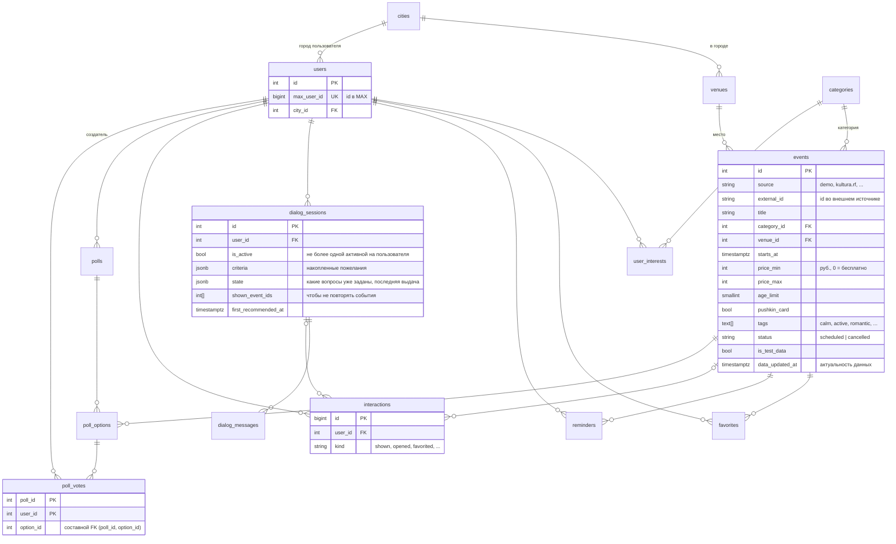

# Модель данных

СУБД — PostgreSQL 16. Схема создаётся миграцией Alembic ([`0001_initial_schema.py`](../backend/migrations/versions/0001_initial_schema.py)),
которая сгенерирована из моделей SQLAlchemy; тест `test_models_match_migrations` следит, чтобы они не расходились.

## ER-диаграмма

## Таблицы

| Таблица | Назначение | Сценарии / истории |
|---|---|---|
| `cities`, `venues` | Справочник городов и площадок с координатами | Масштабирование на другие города: добавляются строки, код не меняется |
| `categories` | Категории событий (концерты, театр, спорт, волонтёрство…) | Выбор темы, интересы пользователя |
| `events` | Афиша: время, цена, возраст, Пушкинская карта, теги настроения, источник и дата актуальности | Подбор, каталог, карточки с «источником и датой» |
| `users` | Пользователь MAX (`max_user_id`) и его город | Вход через бота и мини-приложение |
| `user_interests` | Интересы (M:N с категориями) | Персонализация ранжирования |
| `favorites` | Избранное | «Сохранить событие» |
| `reminders` | Напоминание о событии (одно на пару пользователь+событие) | «Напомнить», рассылка воркером бота |
| `dialog_sessions`, `dialog_messages` | Состояние и история диалога с ассистентом | Уточнения («дешевле», «ещё»), продолжение разговора |
| `interactions` | Журнал действий (показано, открыто, избранное, напоминание, клик на билет, голосование) | Метрики пилота |
| `polls`, `poll_options`, `poll_votes` | Голосование «куда пойдём?» между событиями | Выбор компанией |

## Принятые решения

**Целостность на уровне БД, а не только кода**
- Уникальность: `users.max_user_id`, `(source, external_id)` у событий (идемпотентный импорт из внешних источников),
  `(city_id, name)` у площадок, один голос на пользователя в голосовании (`PRIMARY KEY (poll_id, user_id)`).
- Составной внешний ключ `poll_votes (poll_id, option_id) → poll_options (poll_id, id)`: нельзя проголосовать за
  вариант из чужого голосования, даже в обход API.
- `CHECK`-ограничения на цену (`price_min >= 0`, `price_max >= price_min`).
- Частичный уникальный индекс `dialog_sessions (user_id) WHERE is_active`: у пользователя не бывает двух активных диалогов
  даже при гонке двух запросов.
- Каскадное удаление пользовательских данных (`ON DELETE CASCADE`) — удаление пользователя чистит его следы;
  журнал `interactions` при удалении события сохраняется (`SET NULL`).

**Индексы под реальные запросы**
- `events (status, starts_at)` — основной запрос каталога и подбора: «предстоящие, не отменённые, по времени».
- GIN по `events.tags` — фильтр по настроению (`tags && ARRAY[...]`).
- Частичный индекс `reminders (remind_at) WHERE sent_at IS NULL` — воркер выбирает только неотправленные, индекс не растёт
  вместе с историей.
- `interactions (kind, created_at)` — агрегаты метрик за период.

**Гибкость там, где схема заранее неизвестна**
- `dialog_sessions.criteria` и `state` — JSONB: набор критериев подбора будет расти, а строгая схема тут не нужна
  (валидируется моделью Pydantic `Criteria` при каждом чтении).
- Теги настроения — массив `text[]`, а не отдельная таблица: набор небольшой, всегда читается вместе с событием.
  Словарь тегов фиксирован в коде (`assistant/vocabulary.py`), поэтому LLM не может внести неизвестный тег.

**Время и деньги**
- Все моменты времени — `timestamptz` (в UTC), пользователю показываются в часовом поясе города (`TIMEZONE`).
- Цены — целые рубли: копейки афише не нужны, а float для денег не используется.

**Честность данных**
- `events.source`, `events.data_updated_at`, `events.is_test_data` — каждая карточка показывает происхождение и дату
  актуальности, а демонстрационные данные явно помечены (требование организаторов: не выдавать смоделированные
  данные за реальные).

**Что не вынесено намеренно (MVP)**
- Организаторы событий (`organizers`) и очереди модерации — сценарий публикации событий отнесён к «Could have».
- Гео-поиск по расстоянию: у площадок есть координаты, но фильтр по радиусу не реализован (нужен PostGIS или
  `earthdistance`).
